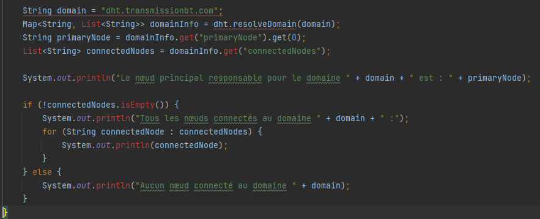
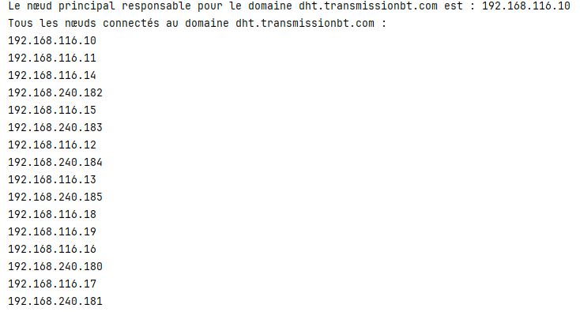
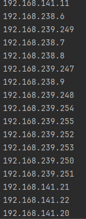
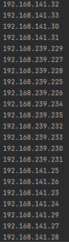
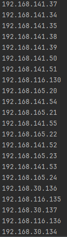

Value for key1: value1 : Cela signifie que la valeur associée à la clé "key1" dans la table de hachage distribuée (Main) est "value1". Lorsque nous avons ajouté cette clé avec sa valeur à la Main, elle a été stockée avec succès et peut être récupérée avec succès en utilisant la clé "key1".

Value for key2: value2 : De manière similaire à la première interprétation, cela indique que la valeur associée à la clé "key2" dans la Main est "value2". La deuxième paire clé-valeur a également été stockée avec succès et peut être récupérée en utilisant la clé "key2".

Value for key1 after Node1 removal: null : Après avoir supprimé le nœud "Node1" de la Main, la valeur associée à la clé "key1" ne peut pas être retrouvée. Cela est indiqué par "null", ce qui signifie qu'aucune valeur n'est associée à cette clé après la suppression du nœud.

Value for key2 after Node1 removal: null : De manière similaire à la troisième interprétation, la valeur associée à la clé "key2" est également introuvable après la suppression du nœud "Node1". Comme pour la clé précédente, cela est indiqué par "null".

